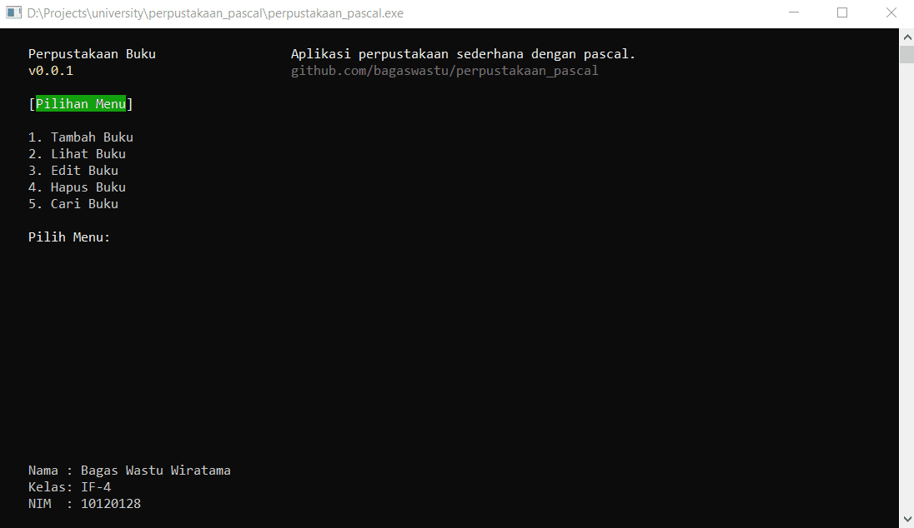

# perpustakaan_pascal
Aplikasi perpustakaan sederhana, dibuat dengan pascal.

Aplikasi ini dibuat untuk memenuhi salah satu tugas mata kuliah algoritma pemrograman.

## Fitur
- Membuat buku baru
- Validasi ISBN
- Validasi input
- Menampilkan list buku
- Mengedit buku
- Menghapus buku
- Mencari buku berdasarkan ISBN
- Sortir buku berdasarkan judul & penulis buku

## Screenshot


## Download
Untuk aplikasi bisa langsung didownload di halaman [release](https://github.com/bagaswastu/perpustakaan_pascal/releases/tag/v.0.0.1)

## Cara Menjalankan Aplikasi
### Persyaratan
Persyaratan yang diperlukan untuk menjalankan aplikasi ini:
- FPC >3.2.0
- Lazarus
### Langkah
1. Clone repository ini:
    ```bash
    git clone https://github.com/bagaswastu/perpustakaan_pascal.git
    ```
2. Open project di **Lazarus**
3. Tekan `F9` untuk menjalankan aplikasi


## Lisensi
Didistribusikan di bawah Lisensi MIT. Lihat `LICENSE` untuk informasi lebih lanjut. 
